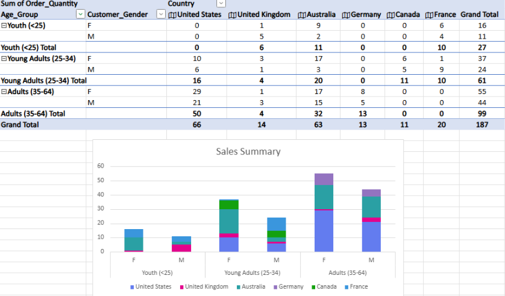
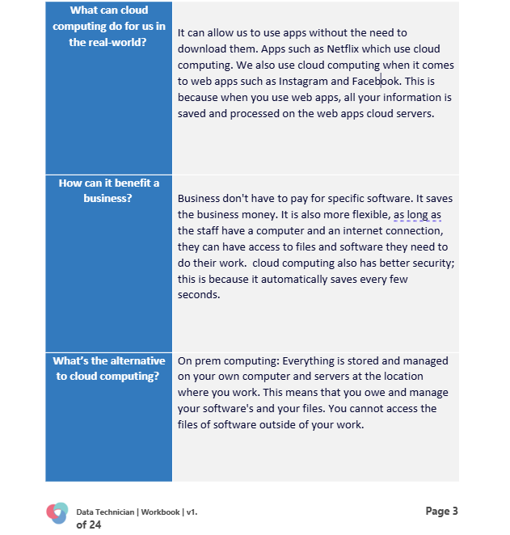

# Portfolio Summary: Workbooks 1 – 5

---

## Week 1 – Excel

During Week 1, I developed foundational Excel skills, focusing on data organization and basic calculations. I learned how to:  

- **Create and format tables** to structure data efficiently.  
- **Sort and filter data using dropdown menus** to analyze information quickly.  
- **Use basic functions such as `SUM`, `AVERAGE`, and `MAX`** to calculate totals, averages, and identify maximum values in datasets.  
- **Apply conditional formatting** to highlight specific data points and make patterns easier to spot.  
- **Work with pivot tables** to summarize large datasets by categories such as county or product.  
- **Use formulas like `SWITCH`** to categorize data based on specific conditions.  
- **Created graphs and charts** to visually represent data, making trends and comparisons easier to interpret.  

These skills improved my ability to manage, analyse, and present data effectively in Excel.  

**Week 1 Workbook Screenshot – Excel**  

---

## Week 2 – Power BI & Tableau

During Week 2, I focused on developing data visualization and analytical skills using Power BI and Tableau. Key tasks included:  

- **Creating dashboards in Tableau & Power BI** using different dataset in skillable:  
  - A bar chart to display percentage changes.  
  - A UK map visualization highlighting key city locations impacted.

- **Conducting trend analyses** using different datasets:  
  - **Spotify dataset**: Identified trends and key insights that could inform future organizational projects.  
  - **Health dataset**: Analyzed trends to provide insights that could support decision-making and future initiatives in healthcare, particularly within the NHS.  

- **Understanding the value of data in decision-making**: Reflected on how insights from health data can support NHS planning, resource allocation, and patient care improvements.  

- **Completing practical labs (Lab 1–5) in Skillable**: Developed hands-on experience with Power BI and Tableau functionalities, including creating visualizations, connecting datasets, and building interactive dashboards.  

These activities enhanced my ability to analyse datasets, create meaningful visualizations, and present actionable insights to support data-driven decision-making.  

**Week 2 Workbook Screenshot – Power BI & Tableau**  

---

## Week 3 – SQL Skills Summary

During Week 3, I focused on understanding and applying core database concepts and SQL skills. Key activities included:  

- **Learning database concepts**:  
  - Explored primary keys, secondary keys, and foreign keys and their roles in ensuring data integrity and establishing relationships between tables.  

- **Understanding JOINs**:  
  - Researched and explained different types of SQL JOINs (INNER, LEFT, RIGHT, FULL) and how they are used to combine related data from multiple tables.  
  - Provided practical examples showing which datasets each JOIN type could be applied to.  

- **Database design for a small retail business**:  
  - Analyzed business requirements, identifying data needs for inventory, sales, customer information, and loyalty programs.  
  - Designed database schema including tables and relationships to efficiently manage operations.  
  - Wrote SQL examples to create tables, define relationships, and implement constraints.  
  - Practiced populating databases with `INSERT` statements and maintaining accuracy.  
  - Considered database maintenance, backups, and security measures to ensure a robust system.  

- **SQL practical exercises**:  
  - Set up and explored the `world_db` database.  
  - Executed SQL queries to retrieve and manipulate data.  
  - Documented both the SQL syntax and the query outputs, reinforcing hands-on experience.  

These tasks enhanced my understanding of database design, relational data management, and practical SQL skills, preparing me to create functional and efficient databases.  

**Week 3 Workbook Screenshot – SQL**  

---

## Week 4 – Azure

During Week 4, I focused on developing knowledge of cloud computing concepts, cybersecurity legislation, and practical experience with Azure. Key activities included:  

- **Cloud computing fundamentals**:  
  - Researched core concepts of cloud computing and alternatives such as on-premises computing.  
  - Explored various cloud service offerings and their real-world use cases.  
  - Studied different cloud deployment models: public, private, hybrid, and community clouds, including when each model is appropriate and examples of organizations that could implement them.  

- **Cybersecurity and legislation**:  
  - Learned about the Computer Misuse Act 1990, understanding the types of computer-related offenses it addresses.  
  - Studied the Police and Justice Act 2006 (Computer Misuse) and the additional powers it grants to authorities.  

- **Practical Azure experience**:  
  - Completed Skillable labs (Lab 3–5) on exploring relational data in Azure, gaining hands-on experience in cloud-based database management and data exploration.  

These activities enhanced my understanding of cloud computing environments, cybersecurity legislation, and practical skills in using Azure to manage and explore relational data.  

**Week 4 Workbook Screenshot – Azure**  

---

## Week 5 – Python

During Week 5, I focused on Python programming and data analysis using Pandas, developing skills in coding, data manipulation, and exploration. Key activities included:  

- **Python programming practice**:  
  - Implemented the FizzBuzz exercise, applying conditional statements and loops to iterate through integers and output results based on divisibility rules.  

- **Data loading and exploration using Pandas**:  
  - Read CSV files into Pandas DataFrames.  
  - Displayed the first and last rows, explored DataFrame structure, and generated summary statistics.  

- **Indexing, slicing, and selecting data**:  
  - Selected individual columns, multiple columns, specific rows, and filtered data based on conditions.  

- **Data manipulation**:  
  - Added new columns (e.g., a column to indicate if a student passed).  
  - Renamed columns and dropped unnecessary columns.  

- **Aggregation and grouping**:  
  - Grouped data by categorical columns to calculate means.  
  - Counted occurrences per group and calculated averages by categories like gender.  

- **Advanced data operations**:  
  - Created pivot tables to summarize data across multiple dimensions.  
  - Generated new columns based on conditional logic to assign grades.  
  - Sorted data by specific columns in descending order.  

- **Working with real-world datasets**:  
  - Explored GDP data, selecting columns, displaying rows, and performing basic analysis.  
  - Collaborated on group activities to explore data interactively and creatively in Jupyter notebooks.  

These activities strengthened my ability to write Python code, manipulate and analyze datasets, and present insights in a clear and structured way, laying a solid foundation for data analysis projects.  

**Week 5 Workbook Screenshot – Python**  

